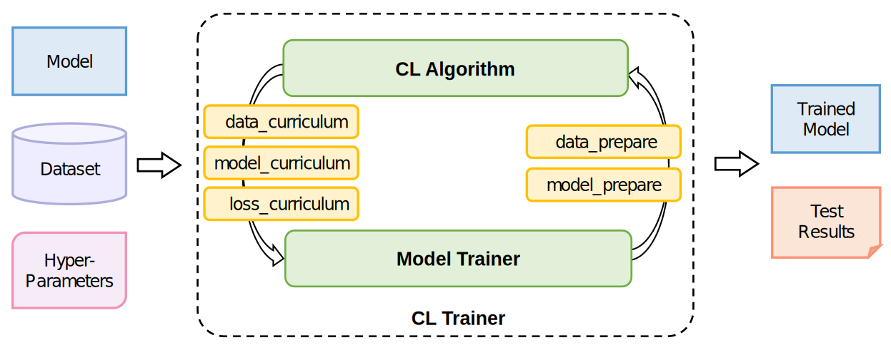
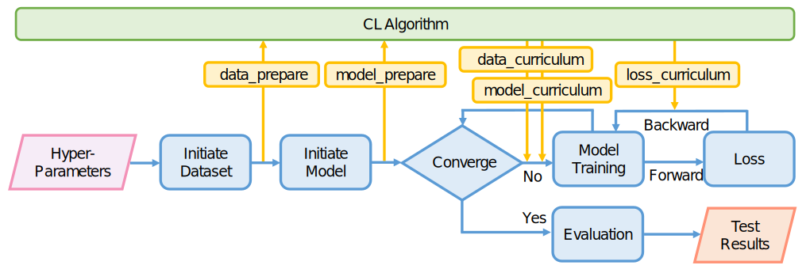

# CurML: A Curriculum Machine Learning Library

A library & toolkit for Curriculum Learning.

The code of the ACM MM 2022 Open Source Software [paper](https://github.com/THUMNLab/CurML/raw/master/docs/CurML.pdf).

Actively under development by @THUMNLab

## Target

1. To reproduce, evaluate and compare existing Curriculum Learning algorithms

2. To provide baselines and benchmarks for Curriculum Learning study.

3. To utilize Curriculum Learning as a plugin to improve the performance of existing works.

## Introduction

The figure below shows the overall framework of the library. The main part is a **CL Trainer** class, composed of a **CL Algorithm** class and a **Model Trainer** class, which interact with each other through five **APIs** of the CL Algorithm class to implement the curriculum.



An general workflow of curriculum machine learning is illustrated below. 



## Environment

1. python >= 3.6

2. pytorch >= 1.9.0

## Quick Start

``` bash
# 1. clone from the repository
git clone https://github.com/THUMNLab/CurML
cd CurML

# 2. pip install local module: curriculum
pip install -e .

# 3. run the example code
python examples/base.py
```

## Development & Extension

Every CL method implemented has been aranged in `/curriculum/algorithms`, each consists of a **Trainer class** and an **Algorithm class**. Their roles and how they interact with each other are illustrated in the figure above. `Image_classifier.py` in `/curriculum/trainer` deals with the whole learning process. It embeds the five **APIs** from existing CL methods, initializing datasets and models, then completes the whole training procedure(forwarding and back propagation). Examples in `/examples` show how you can call the implemented methods, and how to pass the hyperparameters and start training in an easy manner.

For extension, more latest CL algorithms will be added, or you can add your own CL method in `/curriculum/algorithms`, which should be consistent with the overall framework. For convenience, `/curriculum/backbones` incorporates some standard implementations of popular neural networks, including `resnet`, `vgg`, etc. For other customized datasets, you can add your dataset processing scripts in `/curriculum/datasets`, following the example in `cifar10.py`(only support `cifar10` at present). Trainers for tasks other than image classification in the field of CV, NLP, etc., will be implemented in the future.


## Cite

Please cite our [paper](https://dl.acm.org/doi/pdf/10.1145/3503161.3548549) as follows if you find our code useful:
```
@inproceedings{zhou2022curml,
  title={CurML: A Curriculum Machine Learning Library},
  author={Zhou, Yuwei and Chen, Hong and Pan, Zirui and Yan, Chuanhao and Lin, Fanqi and Wang, Xin and Zhu, Wenwu},
  booktitle={Proceedings of the 30th ACM International Conference on Multimedia},
  pages={7359--7363},
  year={2022}
}
```

You may also find our [survey paper](https://arxiv.org/pdf/2010.13166.pdf) helpful:
```
@article{wang2021survey,
  title={A survey on curriculum learning},
  author={Wang, Xin and Chen, Yudong and Zhu, Wenwu},
  journal={IEEE Transactions on Pattern Analysis and Machine Intelligence},
  year={2021},
  publisher={IEEE}
}
```


## License
We follow [Apache license](LICENSE) across the entire codebase from v0.2.
